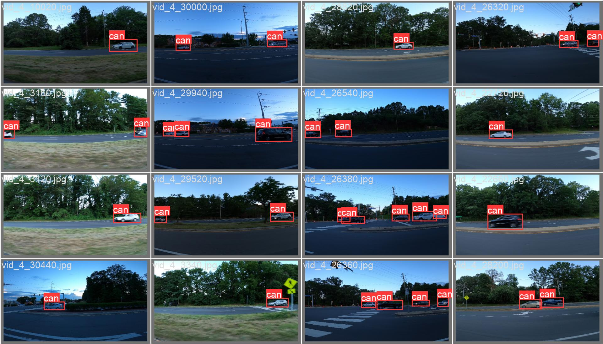

# 🚗 YOLOv8 Car Detection Project

A real-time car detection model trained with the state-of-the-art YOLOv8 architecture on a custom dataset from Kaggle. This project is developed locally using Python and VS Code.

This repository demonstrates the full workflow of an object detection project, including dataset preparation, model training, and inference on new images.

---

## 📊 Results

Here is an example of the trained model detecting a car in a test image. The model successfully identifies the vehicle and draws a bounding box around it.



---

## 🛠️ Technology Stack

* **Python 3.10+**
* **PyTorch**: The deep learning framework used by YOLOv8.
* **Ultralytics YOLOv8**: The core library for the object detection model.
* **OpenCV**: Used for image processing and visualization.
* **Kaggle API**: For downloading the dataset.
* **Visual Studio Code**: As the code editor and development environment.

---

## 📦 Getting Started

Follow these instructions to set up the project on your local machine.

### Prerequisites

* **Python**: Make sure you have Python 3.10 or newer installed.

### Installation & Setup
1.  **Create a `requirements.txt` file**
    Create a file named `requirements.txt` in your project folder and add the following lines to it:
    ```txt
    ultralytics
    kaggle
    opencv-python
    tqdm
    ```

2.  **Create and Activate a Virtual Environment**
    It's highly recommended to use a virtual environment to keep project dependencies isolated.
    ```bash
    # Create the virtual environment
    python -m venv venv

    # Activate it (Windows)
    venv\Scripts\activate

    # Activate it (macOS/Linux)
    # source venv/bin/activate
    ```

3.  **Install Dependencies**
    ```bash
    pip install -r requirements.txt
    ```

4.  **Set Up Kaggle API**
    To download the dataset, you need your Kaggle API key.
    * Download your `kaggle.json` file from your Kaggle account page.
    * Place the `kaggle.json` file in the correct directory. On Windows, this is typically `C:\Users\<Your-Username>\.kaggle\`.

---

## 🚀 Usage

The project is divided into logical steps.

1.  **Prepare the Dataset**
    This step downloads the dataset from Kaggle, unzips it, and converts the labels from `.xml` to the YOLO `.txt` format.
    ```bash
    python prepare_dataset.py 
    ```
    2.  **Train the Model**
    This script loads the prepared dataset and starts the YOLOv8 training process.
    ```bash
    python train.py
    ```
    3.  **Run Inference on an Image**
    After training, use this command to run your custom model on a new image.
    ```bash
    python detect.py --image path/to/your/test_image.jpg
    ```
    ---

## 🔮 Future Improvements

* Train on a larger, more diverse dataset.
* Experiment with different YOLOv8 model sizes (e.g., `yolov8s.pt`, `yolov8m.pt`).
* Deploy the final trained model as a web application using Flask or FastAPI.
* Create a script to run detection on a live webcam feed.
